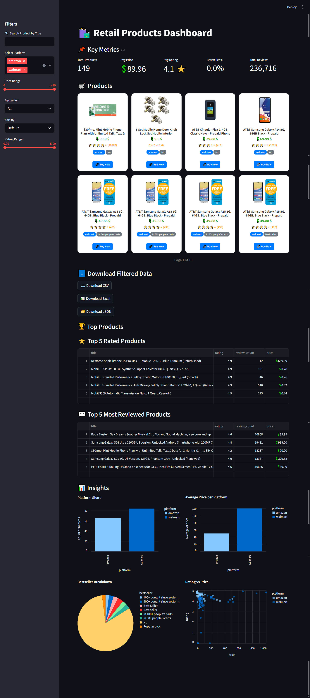
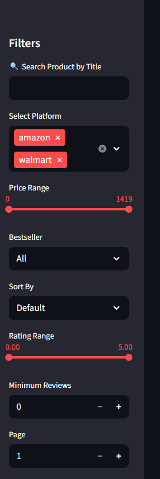
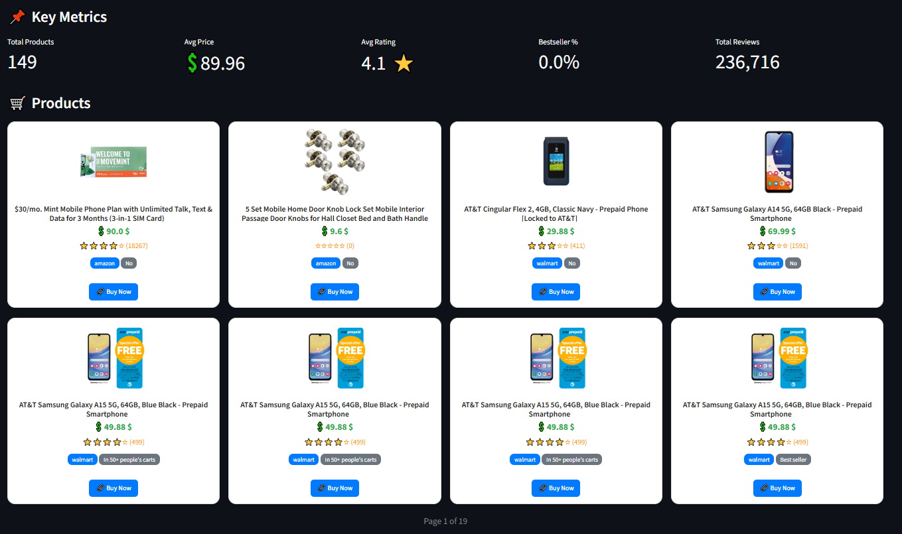
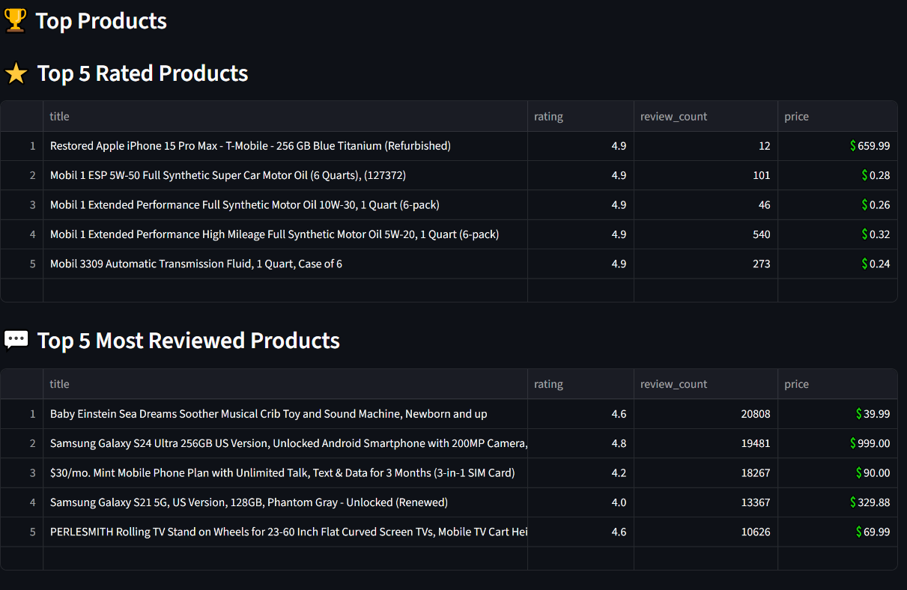
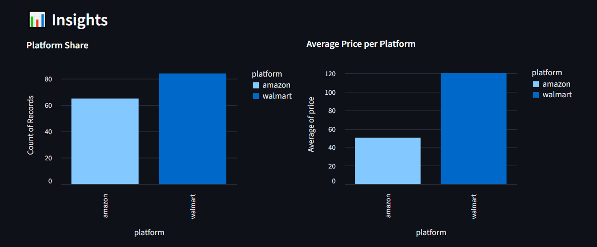
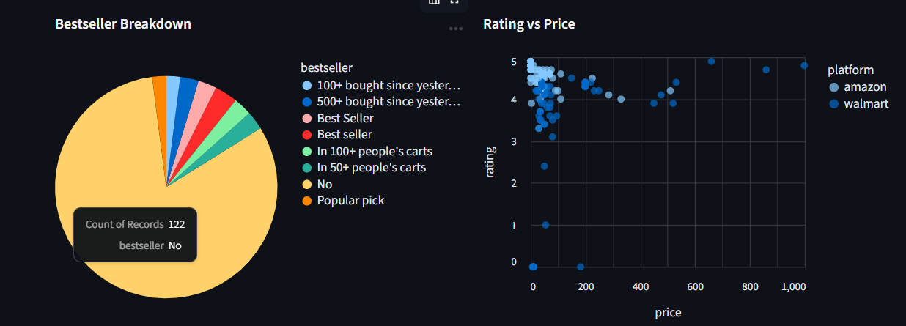

# Retail Intelligence Platform

An **enterprise-grade competitor intelligence solution** for retail and ecommerce.  
This platform scrapes data from major retailers (e.g., Walmart, Amazon, Target), processes it via ETL workflows, stores in PostgreSQL, and provides interactive analytics with Streamlit.

---
## 📸 Streamlit Dashboard Screenshots


| Dashboard Home | Filter Side-bar | Cards And Products |
|:--------------:|:---------------:|:------------------:|
|  |  |  |


| Top Products | Insights | bestseller |
|:------------:|:--------:|:----------:|
|  |  |  |


---

## 🚀 Scrapy Features
- **Multi-site scraping** with Scrapy + Playwright (Walmart, Amazon, Target).
- **ETL Pipeline** → Extract (scraping), Transform (cleaning/normalization), Load (PostgreSQL).
- **Streamlit Dashboard** → Visualize competitor trends, and export data.

---

## 🛠️ Tech Stack
- **Scraping**: Scrapy + Playwright  
- **Database**: PostgreSQL  
- **ETL**: Python (data cleaning + normalization)  
- **Dashboard**: Streamlit (charts, tables, exports)  
---

## 🚀 Stream-Lit Features

- **Database Integration**
  - Real-time connection with PostgreSQL  
  - Auto data cleaning and type conversion  

- **Interactive Filters**
  - 🔍 Search products by title  
  - 📦 Filter by platform  
  - 💲 Price range slider  
  - 🏷️ Bestseller filter (Yes/No)  
  - ↕️ Sort by price or rating  

- **Smart Product Cards**
  - Product image, title, and price  
  - ⭐ Star rating with review counts  
  - Platform and bestseller badges  
  - 🔗 Direct “Buy Now” product link  

- **Pagination**
  - 8 products per page (2 rows × 4 columns)  
  - Sidebar page navigation  

- **Top Products**
  - ⭐ Top 5 Rated Products  
  - 💬 Top 5 Most Reviewed Products  

- **Data Export**
  - ⬇️ Download filtered results as CSV  

- **📊 Visual Insights (Altair Charts)**
  - Platform share (bar chart)  
  - Price distribution (histogram)  
  - Bestseller breakdown (pie chart)  
  - Rating vs Price (scatter chart with tooltips)  
  - Average price per platform (bar chart)  

---

## ⚡ Setup Instructions

### 1. Clone the Repository
```bash
git clone https://github.com/your-username/retail-intelligence-platform.git
cd retail-intelligence-platform
```

### 2. Create Virtual Environment & Install Dependencies
```bash
python -m venv venv
source venv/bin/activate   # On Windows: venv\Scripts\activate
pip install -r requirements.txt
```
### 3. Install Playwright
```bash
playwright install
```
### 4. Create .env File
```bash
retail_intelligence/
│
├── retail_intelligence/   # Scrapy project files
│   ├── settings.py
│   ├── spiders/
│   └── ...
├── .env                   # 🔑 Environment variables here
├── scrapy.cfg
├── requirements.txt
└── README.md
```
### 5. Inside .env File 
```bash
SCRAPEOPS_API_KEY=your_scrapeops_api_key
```
### 6. Setup PostgreSQL Database
```sql
CREATE DATABASE retail_intelligence;
```

Configure connection in `.env` file:
```
DB_HOST=localhost
DB_PORT=5432
DB_NAME=retail_intelligence
DB_USER=your_username
DB_PASS=your_password
```

### 7. Run the Scrapy spider with custom arguments to fetch products from the given URLs and save their HTML content locally...
```bash
scrapy crawl snapshot_spider -a query="mobile" -a product_limit=150  
```
### 8. After completing step 7, run the parser spider to parse the saved HTML files, clean the data, and store it in your PostgreSQL database. You can run it in two ways:
```bash
# Store results directly in PostgreSQL
scrapy crawl snapshot_parser_spider
# Or save output to a JSON file
scrapy crawl snapshot_parser_spider -o data.json 
```

### 9. After Streamlit installed.
```bash
streamlit run dashboard/app.py
```

## 🔹 License
This project is licensed under the **MIT License** – completely free for both personal and commercial use.  
See the [LICENSE](LICENSE) file for details.  

---

## 🔹 Author
👨‍💻 Created & maintained by [Shahzaib Ali](https://github.com/shahzaib-1-no)  
📬 For collaboration or freelance work: **sa4715228@gmail.com**  

---

## 🤝 Contributions
Contributions, issues, and feature requests are welcome!  
Feel free to open an [issue](../../issues/) or submit a PR.
